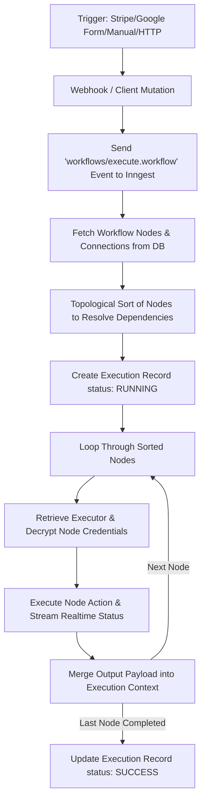

# ⚡ FlowEngine: Visual Workflow Automation Platform (n8n/Zapier Clone)

FlowEngine is a modern, high-performance, visual workflow automation platform designed to let users build, orchestrate, and execute complex workflows. Drawing inspiration from industry leaders like **n8n** and **Zapier**, it couples an interactive node-based builder interface with a robust, event-driven background execution engine.

---

## 🚀 Key Features

- **🎨 Interactive Visual Node Editor**
  - Drag-and-drop workflow canvas built with [@xyflow/react (React Flow)](https://reactflow.dev/).
  - Real-time node status indications and smooth connection routing.
- **⚙️ Event-Driven Execution Engine**
  - Asynchronous execution built on [Inngest](https://www.inngest.com/) for reliable, serverless task queueing and processing.
  - Automatic dependency resolution using topological sorting (`toposort`) to handle complex execution paths.
- **📡 Real-Time Telemetry & Progress**
  - Utilizes Inngest Realtime Channels to stream node execution progress (`loading` -> `success` / `error`) directly to the builder UI in real-time.
- **🔒 Encrypted Credentials Manager**
  - Securely store external API keys (OpenAI, Gemini, Anthropic, DeepSeek).
  - Symmetric encryption at rest via `cryptr` library before database insertion.
- **🤖 Multi-LLM AI Integration**
  - Native AI nodes for **DeepSeek**, **Google Gemini**, **OpenAI**, and **Anthropic Claude**.
  - Prompt interpolation using context parameters.
- **⚡ Diverse Triggers & Actions**
  - **Triggers**: Manual Trigger, Google Forms (Webhook), Stripe (Webhook), and HTTP Requests.
  - **Actions**: Discord notifications, Slack messages, LLM API calls, and custom HTTP outputs.
- **💳 Polar.sh Subscription Integration**
  - Fully-featured monetization using `@polar-sh/better-auth` and `@polar-sh/sdk`.
  - Premium limits checking for workflow creation and credential registration.
- **🩺 Production-Ready Observability**
  - Sentry integration for edge-to-server error monitoring and performance tracking.

---

## 🛠️ Technical Stack

### Frontend

- **Framework**: Next.js 15 (App Router, Turbopack, React 19)
- **Styling**: Tailwind CSS v4, Lucide Icons, Shadcn UI
- **State & Flows**: `@xyflow/react` for the node canvas, Jotai for global state, React Query for cache management
- **Validation**: React Hook Form with Zod

### Backend & API

- **API Protocol**: tRPC (typesafe remote procedure calls)
- **Background Jobs**: Inngest (Event-driven serverless executor)
- **Auth**: Better Auth (GitHub & Google OAuth 2.0)
- **ORM**: Prisma client with PostgreSQL integration

### Tooling

- **Linter & Formatter**: Biome (highly performant alternative to ESLint & Prettier)
- **Task Running**: Concurrently for local multi-service running

---

## 📐 System Architecture & Workflow Execution

Flows in FlowEngine operate as a Directed Acyclic Graph (DAG). Here is how a workflow executes under the hood:



### Key Architectural Files

1.  **Database Model & Schema**: [schema.prisma](file:///d:/Project/React.Js/n8n-zapier-clone/N8N-Zapier-Clone/prisma/schema.prisma) — Defines the relations between users, workflows, nodes, connections, executions, and credentials.
2.  **Inngest Workflow Engine**: [functions.ts](file:///d:/Project/React.Js/n8n-zapier-clone/N8N-Zapier-Clone/inngest/functions.ts) — Performs the topological sorting, prepares the runner context, runs the registered node executors, and records the final execution outcome.
3.  **Executors Registry**: [executor-registry.ts](file:///d:/Project/React.Js/n8n-zapier-clone/N8N-Zapier-Clone/features/execution/lib/executor-registry.ts) — Maps Node Types (`NodeType.GEMINI`, `NodeType.SLACK`, etc.) to their specific node runner logic.
4.  **Reusable Dashboards UI**: [entry-components.tsx](file:///d:/Project/React.Js/n8n-zapier-clone/N8N-Zapier-Clone/components/entry-components.tsx) — Provides a clean, standardized UI layer for pagination, search, loading, and listing items.

---

## ⚙️ Environment Variables Setup

Before running the application, create a `.env.local` file by copying the template file:

```bash
cp .env.example .env.local
```

Open `.env.local` and configure the following variables:

- `DATABASE_URL`: PostgreSQL connection string (e.g. Neon serverless URL).
- `NEXT_PUBLIC_APP_URL`: Base URL (default is `http://localhost:3000`).
- `GITHUB_CLIENT_ID` & `GITHUB_CLIENT_SECRET`: GitHub OAuth App credentials.
- `GOOGLE_CLIENT_ID` & `GOOGLE_CLIENT_SECRET`: Google OAuth App credentials.
- `POLAR_ACCESS_TOKEN`: API token generated from your Polar.sh developer profile.
- `ENCRYPTION_KEY`: A secure random password or string to encrypt API keys stored in the database.
- `INNGEST_EVENT_KEY` & `INNGEST_SIGNING_KEY`: Needed for Inngest cloud deployments. Can remain blank for local runs.

---

## 🏃 Running the Application Locally

Follow these steps to configure your local development environment:

### 1. Install Dependencies

```bash
npm install
```

### 2. Prepare Database Schema

Push the Prisma schema to your PostgreSQL database instance:

```bash
npx prisma db push
```

### 3. Launch Development Servers

FlowEngine relies on both Next.js and the Inngest Dev Server running simultaneously.

#### Run Next.js and Inngest Local Dev Server:

```bash
npm run dev:all
```

- This command fires up the Next.js site on [http://localhost:3000](http://localhost:3000) and the Inngest local dashboard on [http://localhost:8288](http://localhost:8288).

#### Run with Local Webhook Redirection (ngrok):

If you want to test webhooks (like Stripe or Google Forms) locally:

```bash
npm run dev:all:ngrok
```

- This automatically proxies requests to your local instance from the web via an ngrok tunnel.

---

## 📁 Project Directory Structure

```text
├── app/                      # Next.js Pages Router replacement (App Router)
│   ├── (auth)/               # Auth routes layout & login pages
│   ├── (dashboard)/          # Dashboard section
│   │   ├── (editor)/         # Interactive React Flow workflow editor
│   │   └── (rest)/           # Credentials, executions, and workflows dashboards
│   └── api/                  # API endpoints (Auth, Inngest, Webhooks, tRPC)
├── components/               # Shareable UI elements (shadcn/ui, custom templates)
├── config/                   # Constant configuration schemas
├── features/                 # Modular domain logic
│   ├── auth/                 # Authentication features and Better Auth hooks
│   ├── credential/           # API credential encryption, CRUD, and tRPC routers
│   ├── editor/               # Flow editor buttons, canvas, and layout
│   ├── execution/            # Background engine runtime and executor registry
│   ├── subscriptions/        # Premium limits & Polar.sh subscription flows
│   ├── triggers/             # Individual node components & runner executions
│   └── workflows/            # Workflow database actions, lists, and hooks
├── hooks/                    # Reusable React hooks
├── inngest/                  # Inngest event definitions, channels, and execution functions
├── lib/                      # Base configurations (Database init, encryption layers)
├── prisma/                   # Prisma schema mapping database structure
└── public/                   # Public assets & icons
```

---

## 🛠️ Code Standards & Formatting

We use **Biome** for fast formatting and linting.

- To run biome linter and check for issues:
  ```bash
  npm run lint
  ```
- To format files automatically:
  ```bash
  npm run format
  ```

---

## 📄 License

This project is licensed under the MIT License. See the [LICENSE](LICENSE) file for details.
