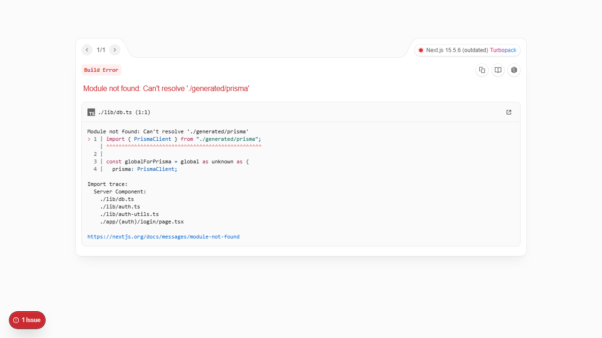
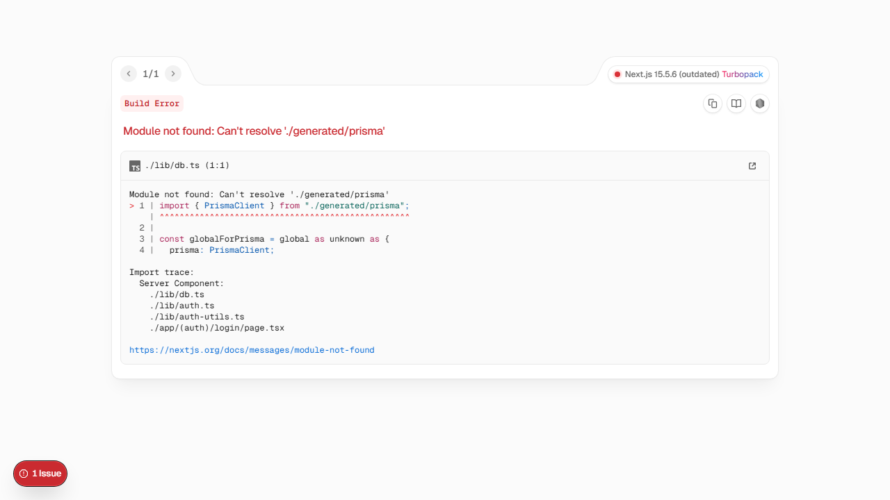

# FlowEngine - n8n/Zapier Clone

FlowEngine is a full-stack visual automation platform where users build node-based workflows and execute them asynchronously.
It combines a React Flow editor, typed tRPC APIs, Prisma/PostgreSQL persistence, and Inngest-powered execution.

## Current application screenshots

### Login


### Signup


### Workflows


### Credentials


### Executions


## Features

- Visual drag-and-drop workflow builder (`@xyflow/react`)
- Trigger and action based automations
- Asynchronous execution engine with ordered DAG processing
- Real-time execution updates through Inngest realtime channels
- Encrypted credentials vault for external provider API keys
- Multi-provider AI nodes (OpenAI, Gemini, Anthropic, DeepSeek)
- Built-in auth (email/password + Google/GitHub)
- Subscription management using Polar
- Sentry error monitoring

## Tech stack

| Layer | Technology |
| --- | --- |
| Frontend | Next.js 15 (App Router), React 19, Tailwind CSS 4, shadcn/ui |
| API | tRPC + TanStack Query |
| Editor | React Flow (`@xyflow/react`) |
| Database | PostgreSQL + Prisma |
| Auth | Better Auth |
| Background jobs | Inngest |
| Validation | Zod + React Hook Form |
| Observability | Sentry |
| Tooling | TypeScript, Biome |

## Supported nodes

**Triggers**
- Manual
- HTTP request
- Google Form
- Stripe

**Actions**
- OpenAI
- Gemini
- Anthropic
- DeepSeek
- Discord
- Slack

## Project structure

```text
app/            # Next.js routes (auth, dashboard, editor, api)
components/     # Shared UI components
features/       # Domain modules (workflows, execution, triggers, auth...)
inngest/        # Inngest client, functions, realtime channels
lib/            # DB, auth, encryption, and shared server utilities
prisma/         # Prisma schema and migrations
trpc/           # tRPC server/client integration
public/         # Static assets
```

## Getting started

### 1. Install dependencies

```bash
npm install
```

### 2. Configure environment variables

Create a `.env.local` file in the project root:

```env
DATABASE_URL=
NEXT_PUBLIC_APP_URL=http://localhost:3000
GITHUB_CLIENT_ID=
GITHUB_CLIENT_SECRET=
GOOGLE_CLIENT_ID=
GOOGLE_CLIENT_SECRET=
ENCRYPTION_KEY=
POLAR_ACCESS_TOKEN=
POLAR_SUCCESS_URL=
INNGEST_EVENT_KEY=
INNGEST_SIGNING_KEY=
```

### 3. Prepare database schema

```bash
npx prisma db push
```

### 4. Run app only

```bash
npm run dev
```

### 5. Run app + Inngest (recommended for local workflow execution)

```bash
npm run dev:all
```

## Scripts

| Script | Description |
| --- | --- |
| `npm run dev` | Start Next.js app (Turbopack) |
| `npm run dev:all` | Start Next.js + Inngest dev server |
| `npm run dev:ngrok` | Start Next.js + ngrok |
| `npm run dev:all:ngrok` | Start Next.js + Inngest + ngrok |
| `npm run build` | Build for production |
| `npm run start` | Start production server |
| `npm run lint` | Run Biome checks |
| `npm run format` | Format code with Biome |

## Execution flow (high-level)

1. A trigger starts the workflow.
2. The app sends an execution event to Inngest.
3. Nodes are sorted and executed in dependency order.
4. Each node output is merged into shared context.
5. Execution state is streamed back to the UI in real time.

## License

MIT
